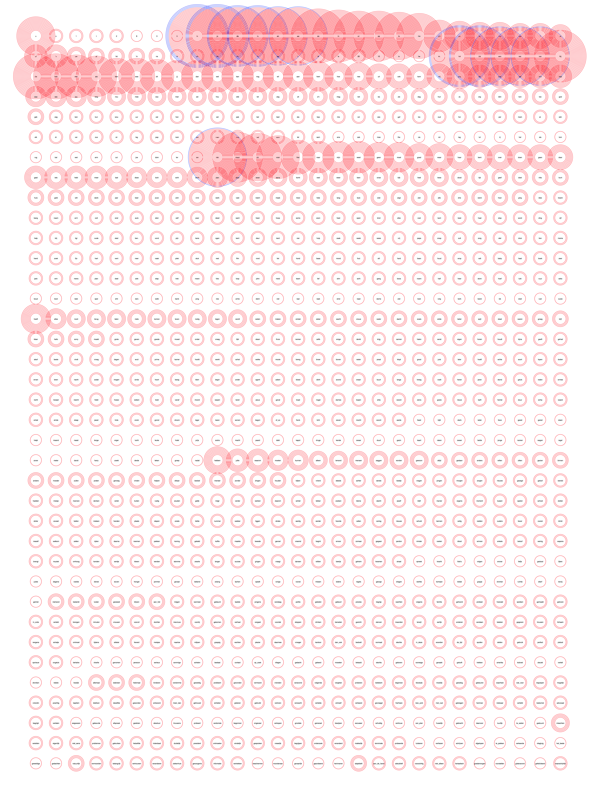

# Wordgraph
Word frequency graph

# Illustrator sketch

- Words in order of word length
- Cirkels size -> frequency
- Color -> type (ww, bw, ...)

Python Graph

- Word order is now from biggest frequency to smallest -> has to change to smallest word/longest word

--> Sketch_01.pv

